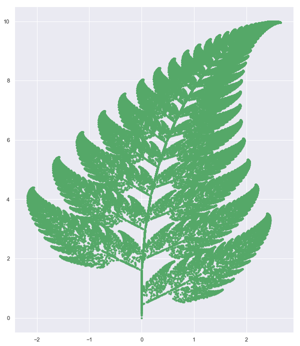
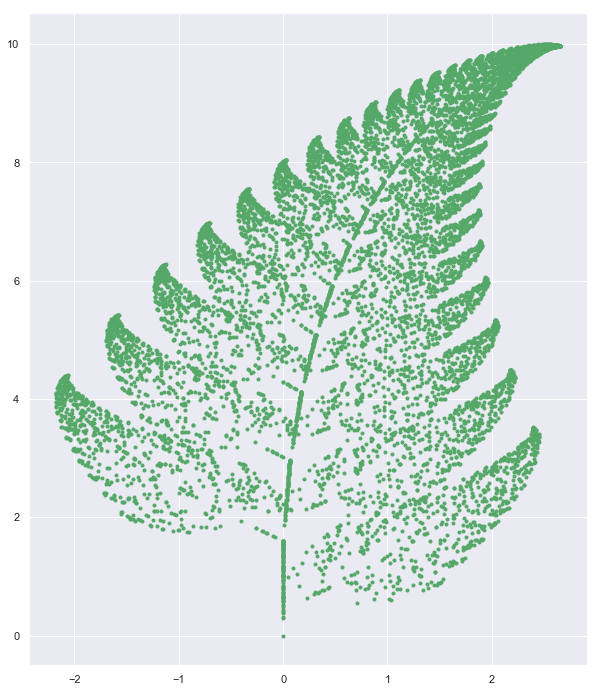

# 1.2. For loop, while loop and If conditions

-------


```python
'''Iterate over the items in a list'''
for item in ['apple','banana','kite','cellphone']:
    print(item)
```

    apple
    banana
    kite
    cellphone


```python
L = []
for k in range(10):
    print(k)
    '''Append values to list L'''
    L.append(k)
```

    0
    1
    2
    3
    4
    5
    6
    7
    8
    9


```python
L
```


    [0, 1, 2, 3, 4, 5, 6, 7, 8, 9]


```python
D = {}
for i in range(5):
    for j in range(5):
        if i ==j :
            print(i,"is equal to",j)
            '''update dictionary with (i,j) as key and 2*i as value'''
            D.update({(i,j) : 2*i})
        elif i!= j:
            '''update dictionary with (i,j) as key and 2*i as value'''
            D.update({(i,j) : i+j})
            print(i,"is not equal to",j)
        
```

    0 is equal to 0
    0 is not equal to 1
    0 is not equal to 2
    0 is not equal to 3
    0 is not equal to 4
    1 is not equal to 0
    1 is equal to 1
    1 is not equal to 2
    1 is not equal to 3
    1 is not equal to 4
    2 is not equal to 0
    2 is not equal to 1
    2 is equal to 2
    2 is not equal to 3
    2 is not equal to 4
    3 is not equal to 0
    3 is not equal to 1
    3 is not equal to 2
    3 is equal to 3
    3 is not equal to 4
    4 is not equal to 0
    4 is not equal to 1
    4 is not equal to 2
    4 is not equal to 3
    4 is equal to 4


```python
D
```


    {(0, 0): 0,
     (0, 1): 1,
     (0, 2): 2,
     (0, 3): 3,
     (0, 4): 4,
     (1, 0): 1,
     (1, 1): 2,
     (1, 2): 3,
     (1, 3): 4,
     (1, 4): 5,
     (2, 0): 2,
     (2, 1): 3,
     (2, 2): 4,
     (2, 3): 5,
     (2, 4): 6,
     (3, 0): 3,
     (3, 1): 4,
     (3, 2): 5,
     (3, 3): 6,
     (3, 4): 7,
     (4, 0): 4,
     (4, 1): 5,
     (4, 2): 6,
     (4, 3): 7,
     (4, 4): 8}


```python
for i,j in zip(range(5),range(5)):
    print(i,j)
```

    0 0
    1 1
    2 2
    3 3
    4 4


```python
for i,item in enumerate(['apple','banana','kite','cellphone']):
    print(i, item)
```

    0 apple
    1 banana
    2 kite
    3 cellphone


```python
A = [0 for k in range(10)]
A
```


    [0, 0, 0, 0, 0, 0, 0, 0, 0, 0]


```python
A = [k for k in range(10)]
A
```


    [0, 1, 2, 3, 4, 5, 6, 7, 8, 9]


```python
L = [[1,2,3],[3,4,5],[5,7,9]]

for i in range(len(L)): 
    for j in range(len(L[0])):
        print(L[i][j])
```

    1
    2
    3
    3
    4
    5
    5
    7
    9


```python
LL = [[k+j for k in range(10)]for j in range(10)]
LL
```


    [[0, 1, 2, 3, 4, 5, 6, 7, 8, 9],
     [1, 2, 3, 4, 5, 6, 7, 8, 9, 10],
     [2, 3, 4, 5, 6, 7, 8, 9, 10, 11],
     [3, 4, 5, 6, 7, 8, 9, 10, 11, 12],
     [4, 5, 6, 7, 8, 9, 10, 11, 12, 13],
     [5, 6, 7, 8, 9, 10, 11, 12, 13, 14],
     [6, 7, 8, 9, 10, 11, 12, 13, 14, 15],
     [7, 8, 9, 10, 11, 12, 13, 14, 15, 16],
     [8, 9, 10, 11, 12, 13, 14, 15, 16, 17],
     [9, 10, 11, 12, 13, 14, 15, 16, 17, 18]]


```python
i = 0
while i< 10:
    print( i, "th turn")
    i = i+1
```

    0 th turn
    1 th turn
    2 th turn
    3 th turn
    4 th turn
    5 th turn
    6 th turn
    7 th turn
    8 th turn
    9 th turn


```python
import json 
with open('data/mylist.json', 'r') as f1:
    LL =  json.load(f1)
```


```python
LL
```


    [[0.11928436893449268, 0.21514257601821907, 0.44266449495004156],
     [0.12952027810948585, 0.09342318120819104, 0.2879457869863208],
     [0.23100236903452465, 0.9997780845317613, 0.47088719020956415]]


```python
for i in range(len(LL)):
    for j in range(len(LL[0])):
        print(LL[i][j])

```

    0.11928436893449268
    0.21514257601821907
    0.44266449495004156
    0.12952027810948585
    0.09342318120819104
    0.2879457869863208
    0.23100236903452465
    0.9997780845317613
    0.47088719020956415


```python
import json 
with open('data/mydic.json', 'r') as f2:
    DD =  json.load(f2)
```


```python
DD
```


    {'A': [0.8623300586958146,
      0.9817282451404751,
      0.918013419185538,
      0.7163654763224003,
      0.9605939306786828,
      0.10535569850024595,
      0.11017993829505879,
      0.7967874445465515,
      0.40100560974033395,
      0.6683804538904957],
     'B': [0.9108032733225849,
      0.5126845596833859,
      0.2889475226297349,
      0.4361419616905007,
      0.9162781988261498,
      0.6417420997937421,
      0.5703303219382578,
      0.8317203028864074,
      0.9987773067590386,
      0.19901433153401582],
     'C': [0.6877286885216957,
      0.16565933820204293,
      0.25063345210121424,
      0.31595887595060124,
      0.03522116131022823,
      0.5286776181365936,
      0.8154337189974739,
      0.8202821745739262,
      0.0672014040433101,
      0.12327287509980445],
     'D': [0.4836330819912691,
      0.8546497284804153,
      0.14752285825255218,
      0.5918584543549938,
      0.14518319590340412,
      0.025762251428333438,
      0.016788596008689316,
      0.009725555304236244,
      0.8177641188673302,
      0.5450138847266498],
     'E': [0.6456541452062622,
      0.7662672636891902,
      0.04445215914793821,
      0.3159171150800496,
      0.9400712936126994,
      0.6085210458061509,
      0.6029509689621034,
      0.34555270993185316,
      0.7452915466172698,
      0.03229045002223074]}


```python
for key,value in DD.items():
    print(key, " : " , value)
```

    A  :  [0.8623300586958146, 0.9817282451404751, 0.918013419185538, 0.7163654763224003, 0.9605939306786828, 0.10535569850024595, 0.11017993829505879, 0.7967874445465515, 0.40100560974033395, 0.6683804538904957]
    B  :  [0.9108032733225849, 0.5126845596833859, 0.2889475226297349, 0.4361419616905007, 0.9162781988261498, 0.6417420997937421, 0.5703303219382578, 0.8317203028864074, 0.9987773067590386, 0.19901433153401582]
    C  :  [0.6877286885216957, 0.16565933820204293, 0.25063345210121424, 0.31595887595060124, 0.03522116131022823, 0.5286776181365936, 0.8154337189974739, 0.8202821745739262, 0.0672014040433101, 0.12327287509980445]
    D  :  [0.4836330819912691, 0.8546497284804153, 0.14752285825255218, 0.5918584543549938, 0.14518319590340412, 0.025762251428333438, 0.016788596008689316, 0.009725555304236244, 0.8177641188673302, 0.5450138847266498]
    E  :  [0.6456541452062622, 0.7662672636891902, 0.04445215914793821, 0.3159171150800496, 0.9400712936126994, 0.6085210458061509, 0.6029509689621034, 0.34555270993185316, 0.7452915466172698, 0.03229045002223074]


```python
DNA = 'ATGCATGCATATCAAGCTAGCTAGCTAGCTAGCTAGAGCTATTTAATGCTA\
        GCTATATAGCGCTAGCTATAGCTAGCTAGCTAGCTAGCTAGCTAGCTAGCT\
        AGCTAGCTAGCTAGCTAGCTAGCTAGCTAGCTAGCTAGCTAGCGCGCGCTA\
        TATATAGAGAGAGAGAGAGACACACATATATCTCTCTCTCTCGAGATCGAT\
        CGTACTAGCTAGCTAGCTAGCTAGCTAGCT'
```


```python
DNA.count('A'),DNA.count('AT')
```


    (66, 16)


```python
count = 0
for letter in DNA:
    if letter == 'T':
        count = count+1
count
```


    61


#### Q: find sum from 0 to 1000


```python
s = 0
for i in range(1000+1):
    s = s+i
s
```


    500500


#### Q: find sum from 0 to 1000 (only even)


```python
s = 0
LE = []
for i in range(1000+1):
    if i%2 ==0:
        LE.append(i)
        s = s+i
s, sum(LE)
```


    (250500, 250500)


--------

### Project: Fern


```python
import numpy as np
import pandas as pd
import matplotlib.pyplot as plt
import seaborn as sns
import random as random
%matplotlib inline
sns.set()
```

https://en.wikipedia.org/wiki/Barnsley_fern

#### Method - 1: Blind implementation 


```python
import random as random
x = 0
y = 0
X = [x]
Y = [y]
n = 1
while n < 100000:
    r = random.uniform(0,100)
    if r <  1.0:
        x = 0
        y = 0.16*Y[n-1]
        X.append(x);Y.append(y)
    elif r > 1.0 and r < 86.0:
        x = 0.85*X[n-1] + 0.04*Y[n-1]
        y = -0.04*X[n-1] + 0.85*Y[n-1]+1.6
        X.append(x);Y.append(y)
    elif r > 86.0 and r < 93.0:
        x = 0.2*X[n-1] - 0.26*Y[n-1]
        y = 0.23*X[n-1] + 0.22*Y[n-1] + 1.6
        X.append(x);Y.append(y)
    elif r > 93.0 and r < 100.0:
        x = -0.15*X[n-1] + 0.28*Y[n-1]
        y = 0.26*X[n-1] + 0.24*Y[n-1] + 0.44
        X.append(x);Y.append(y)
        
    n = n+1
    
```


```python
import json
with open ('data/fern.json', 'w')as f1:
    json.dump([X,Y],f1)
```


```python
import matplotlib.pyplot as plt
plt.figure(figsize = [10,12])
plt.scatter(X,Y,color = 'g',marker = '.')
plt.savefig('plot/charge-lattice.png')    
plt.show()
```





#### Method-2 : Manual Matrix Multiplication

These correspond to the following transformations:

$ {\displaystyle f_{1}(x,y)={\begin{bmatrix}\ 0.00&\ 0.00\ \\0.00&\ 0.16\end{bmatrix}}{\begin{bmatrix}\ x\\y\end{bmatrix}}}$

${\displaystyle f_{2}(x,y)={\begin{bmatrix}\ 0.85&\ 0.04\ \\-0.04&\ 0.85\end{bmatrix}}{\begin{bmatrix}\ x\\y\end{bmatrix}}+{\begin{bmatrix}\ 0.00\\1.60\end{bmatrix}}}$

$ {\displaystyle f_{3}(x,y)={\begin{bmatrix}\ 0.20&\ -0.26\ \\0.23&\ 0.22\end{bmatrix}}{\begin{bmatrix}\ x\\y\end{bmatrix}}+{\begin{bmatrix}\ 0.00\\1.60\end{bmatrix}}}$

${\displaystyle f_{4}(x,y)={\begin{bmatrix}\ -0.15&\ 0.28\ \\0.26&\ 0.24\end{bmatrix}}{\begin{bmatrix}\ x\\y\end{bmatrix}}+{\begin{bmatrix}\ 0.00\\0.44\end{bmatrix}}}$


```python
ITR = 100000
```


```python
x = np.array([[0.0,0.0] for k in range(ITR)])
A = np.array([[0.0,0.0],[0.0,0.16]])
B = np.array([[0.85,0.04],[-0.04,0.85]])
C = np.array([[0.20,-0.26],[0.23,0.22]])
D = np.array([[-0.15,0.28],[0.26,0.24]])
AD = np.array([[0.0,0.0],
             [0.0,1.6],
             [0.0,1.6],
             [0.0,0.44]])
```

---------


```python
X =[]
Y = []

x[0,0] = 0.0
x[0,1] = 0.0

t = 1
while t < ITR:
    
    ct = random.uniform(0,100)
    
    '''First condition'''
    if ct < 1.0:       
        for p in range(2):
            x[t,p] = 0.0
            for q in range(2):
                x[t,p] = x[t,p] + A[p,q]*x[t-1,q]
                
                
        '''second condition'''            
    elif ct > 1.0 and ct < 86.0:
        for p  in range(2):
            x[t,p] = 0.0
            for q in range(2):
                x[t,p] = x[t,p] + B[p,q]*x[t-1,q]
                       
        for  p in range(2):
            x[t,p] = x[t,p]  + AD[1,p]
            
            
        '''third condition'''                 
    elif ct > 86.0 and ct < 93.0:
        for p  in range(2):
            x[t,p] = 0.0
            for q  in range(2):
                x[t,p] = x[t,p] + C[p,q]*x[t-1,q]
                      
                       
        for p in range(2):
            x[t,p] = x[t,p]  + AD[2,p]
            
        '''fourth condition '''                 
    elif  ct > 93.0 and ct < 100.0:
        for p in range(2):
            x[1,p] = 0.0
            for q  in range(2):
                x[t,p] = x[t,p] + D[p,q]*x[t-1,q]
                     
                       
        for p in range(2):
            x[t,p] = x[t,p]  + AD[3,p]
                     
                 


    X.append(x[t,0])
    Y.append(x[t,1])
    t = t +1

                      
```


```python
plt.figure(figsize = [10,12])
plt.scatter(X,Y,color = 'g',marker = '.')
plt.savefig('plot/fern.pdf')    
plt.show()
```


### Method 3-Numpy


```python
'''Matrices'''
A = np.array([[0.0,0.0],[0.0,0.16]])
B = np.array([[0.85,0.04],[-0.04,0.85]])
C = np.array([[0.20,-0.26],[0.23,0.22]])
D = np.array([[-0.15,0.28],[0.26,0.24]])
AD = np.array([[0.0,0.0],
             [0.0,1.6],
             [0.0,1.6],
             [0.0,0.44]])
```


```python
u = np.array([0,0])
U = [u]
n = 1

while n < 10000:
    
    '''generate a random number'''
    r = random.uniform(0,100)
    
    
    '''1rst condition'''
    if r <  1.0:
        u = np.dot(A,u)
        U.append(u)
        
        
        '''second condition'''
    elif r > 1.0 and r < 86.0:
        u = np.dot(B,u) + AD[1]
        U.append(u)
        
        
        '''third condition'''
    elif r > 86.0 and r < 93.0:
        u = np.dot(C,u) + AD[2]
        U.append(u)
        
        
        '''fourth condition'''
    elif r > 93.0 and r < 100.0:
        u = np.dot(D,u) + AD[3]
        U.append(u)
        
        
    '''update n'''    
    n = n+1
    
```


```python
plt.figure(figsize = [10,12])
for item in U:
    plt.scatter(item[0],item[1],color = 'g',marker = '.')
plt.show()
```





### The End


```python

```


```python

```
