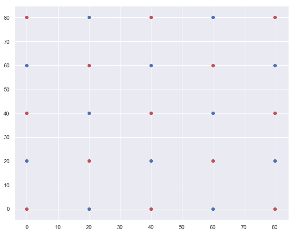
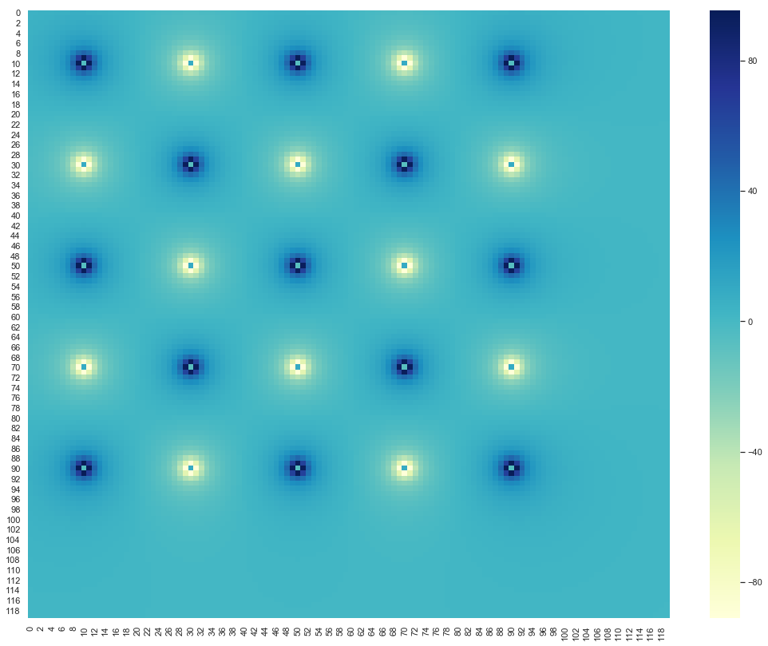
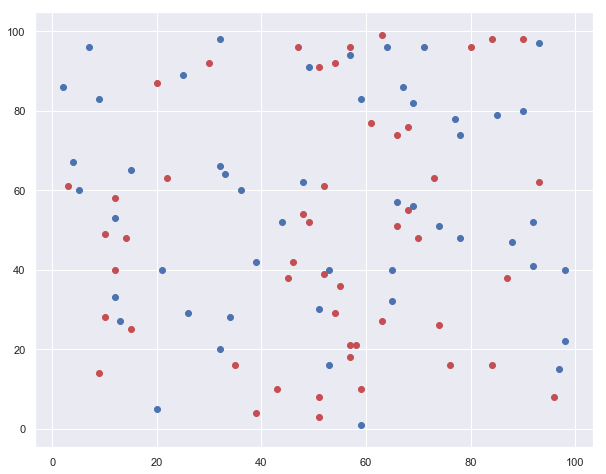
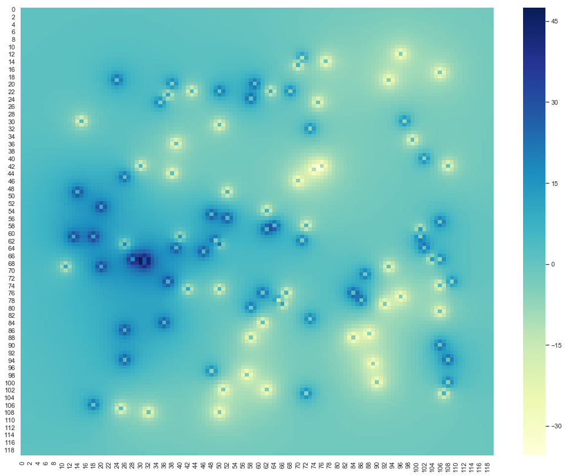
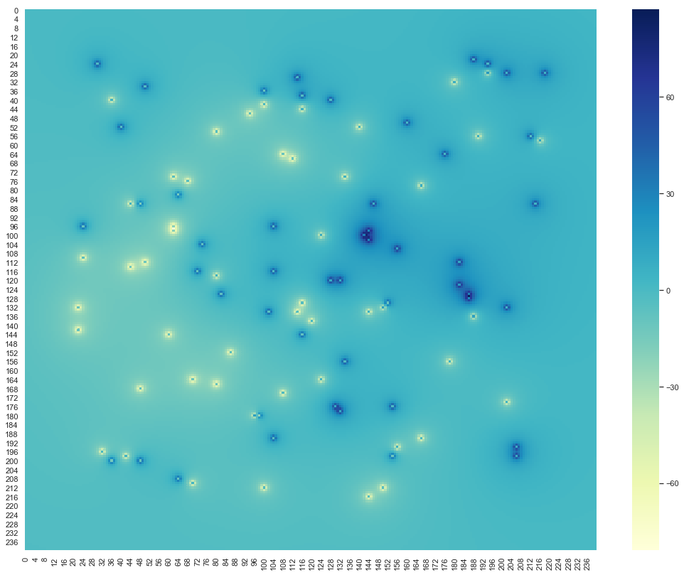

# 1.3. Functions and Classes

---------


```python
import numpy as np
```

### Class Circle


```python
def area(r):
    A = np.pi*r**2
    return A
```


```python
area(10)
```


    314.1592653589793


```python
def circumference(r):
    C = 2*np.pi*r
    return C
```


```python
circumference(10)
```


    62.83185307179586


```python
class Circle():
    def __init__(self, r):
        self.r = r
        
        
    def area(self):
        A = np.pi*self.r**2
        return A
    
    def circumference(self):
        C = 2*np.pi*self.r
        return C
```


```python
Circle(5).area()
```


    78.53981633974483


```python
CC = Circle(5)
CC.area(),CC.circumference()
```


    (78.53981633974483, 31.41592653589793)


```python
CC
```


    <__main__.Circle at 0x1a25768e10>


```python
CC.r
```


    5


```python
for r in [2,3,6,24,25,46,567]:
    CC = Circle(r)
    print("radius: " , r, "area : " , CC.area(), "circumf : " , CC.circumference())
```

    radius:  2 area :  12.566370614359172 circumf :  12.566370614359172
    radius:  3 area :  28.274333882308138 circumf :  18.84955592153876
    radius:  6 area :  113.09733552923255 circumf :  37.69911184307752
    radius:  24 area :  1809.5573684677208 circumf :  150.79644737231007
    radius:  25 area :  1963.4954084936207 circumf :  157.07963267948966
    radius:  46 area :  6647.610054996002 circumf :  289.02652413026095
    radius:  567 area :  1009987.480609929 circumf :  3562.5660691708254


---------

### Project: N-charge system

---------

$ E = q * \frac{\hat{r}}{r}$

$ V  = q * \frac{1}{r}$

$ V  = q * \frac{1}{\sqrt{((x-x^{'})^{2} + (y - y^{'})^{2})}} $


```python
import matplotlib.pyplot as plt
from matplotlib import cm
% matplotlib inline
import seaborn as sns
sns.set()
```

#### Class Charge


```python
class Charge:
    
    '''Data incapsulation'''
    def __init__(self, q, pos):
        self.q = q
        self.pos = pos
        
        
    def line(self, x,y):
        '''create a vector from charge to observation point'''
        self.vector = [x-self.pos[0],y-self.pos[1]]
        '''norm of the vector'''
        self.norm = np.sqrt((self.vector[0])**2+(self.vector[1])**2)
        
    
    def V_point_charge(self, x, y):
        '''recall length'''
        self.line(x,y)
        '''Make sure to exclude source itself'''
        if self.norm >0:
            self.V = self.q/self.norm
            
            '''if length is zero, set V equal to 0'''
        else:
            self.V = 0
        return self.V
    
```

#### Total Electric potential


```python
def V_total(x, y, charges):
    V = 0
    for C in charges:
        Vp = C.V_point_charge(x, y)
        V  = V+Vp
    return V
```

### Implementation - 1 : Lattice of charges


```python
'''first charge to be at x=1,y=1'''
q = 100

'''Dictionary to collect charges, x and y xoordinates'''
Qd = []

'''List to collect Charge objects'''
charges = []


'''use for loops to construct collection of charges objects'''
for i in range(5):
    for j in range(5):
        
        '''This dictionary is collecting charges and their coordinates'''
        Qd.append({"q": q, "x": i*20, "y":j*20})
        
        
        '''charge objects are being collected'''
        charges.append(Charge(q , [20*i, 20*j]))
        
        '''change the sign of charge alternatly'''
        q = -q
  
```


```python
import json
with open ('data/charg-lattice.json', 'w')as f1:
    json.dump(Qd,f1)
```

#### Plot of lattice of charges


```python
'''Plot the lattice of charges'''

plt.figure(figsize = [10,8])

for item in Qd:
    
    '''Sctaeer as red dot if charge is positive'''
    if item['q']> 0:
        plt.scatter(item['x'], item['y'], c = 'r')
        
        
        '''Scatter as blue dot if charge is negative'''
    else:
        plt.scatter(item['x'], item['y'], c = 'b')
        
plt.savefig('plot/charge-lattice.pdf')           
plt.show()
```





#### Find Electric Potential


```python
'''Create X and Y coordinate'''
X = np.arange(-10,110,1)
Y = np.arange(-10,110,1)

'''Initiate vacant V-list of list'''
V = [[0.0 for i in range(len(X))] for j in range(len(Y))]

'''Calculate Electric potential at each x,y coordinate'''
for i,x in enumerate(X):
    for j,y in enumerate(Y):
        v = V_total(x, y, charges)
        V[i][j] = v       
```


```python
VV = np.array(V)
```

#### Save electric potential data


```python
import json
with open ('data/potential-lattice.json', 'w')as f2:
    json.dump(V,f2)
```

##### Plot Electric potential


```python
plt.figure(figsize = [18,14])
sns.heatmap(VV,annot=False,cmap='YlGnBu')
plt.savefig('plot/potential-lattice.png')  
plt.show()
```





### Implementation - 2 : Random Charges


```python
import random as random
```


```python
'''first charge to be at x=1,y=1'''
q = 20

'''Dictionary to collect charges, x and y xoordinates'''
Qd = []

'''List to collect Charge objects'''
charges = []


'''use for loops to construct collection of charges objects'''
for i in range(10):
    for j in range(10):
        
        rx = random.randint(1,100)
        ry = random.randint(1,100)
        
        '''This dictionary is collecting charges and their coordinates'''
        Qd.append({"q": q, "x": rx, "y":ry})
        
        
        '''charge objects are being collected'''
        charges.append(Charge(q , [rx,ry]))
        
        '''change the sign of charge alternatly'''
        q = -q
```

##### Save charge configuration


```python
import json
with open ('data/charg-random.json', 'w')as f3:
    json.dump(Qd,f3)
```

##### Plot charge system


```python
'''Plot the lattice of charges'''

plt.figure(figsize = [10,8])

for item in Qd:
    
    '''Sctaeer as red dot if charge is positive'''
    if item['q']> 0:
        plt.scatter(item['x'], item['y'], c = 'r')
        
        
        '''Scatter as blue dot if charge is negative'''
    else:
        plt.scatter(item['x'], item['y'], c = 'b')
plt.savefig('plot/charge-random.pdf')      
plt.show()
```





##### Calculate electric potential


```python
'''Create X and Y coordinate'''
X = np.arange(-10,110,1)
Y = np.arange(-10,110,1)

'''Initiate vacant V-list of list'''
V = [[0.0 for i in range(len(X))] for j in range(len(Y))]

'''Calculate Electric potential at each x,y coordinate'''
for i,x in enumerate(X):
    for j,y in enumerate(Y):
        v = V_total(x, y, charges)
        V[i][j] = v       
```

##### Save electric potential dta


```python
import json
with open ('data/potential-random.json', 'w')as f4:
    json.dump(V,f4)
```

##### Plot potential


```python
V = np.array(V)
```


```python
plt.figure(figsize = [18,14])
sns.heatmap(V,annot=False,cmap='YlGnBu')
plt.savefig('plot/potential-random.pdf')  
plt.show()
```





#### Much finner


```python
'''Create X and Y coordinate'''
X = np.arange(-10,110,0.5)
Y = np.arange(-10,110,0.5)

'''Initiate vacant V-list of list'''
V = [[0.0 for i in range(len(X))] for j in range(len(Y))]

'''Calculate Electric potential at each x,y coordinate'''
for i,x in enumerate(X):
    for j,y in enumerate(Y):
        v = V_total(x, y, charges)
        V[i][j] = v       
```


```python
V = np.array(V)
```


```python
plt.figure(figsize = [18,14])
sns.heatmap(V,annot=False,cmap='YlGnBu')
plt.savefig('plot/potential-random.pdf')  
plt.show()
```





------------

### Assignment 
***1. Create charges in a circle of radius 25 with 16 charge system***

***3. Save charge configuration data (dictionary) to a json file***

***3. Calculate electric potential for 2D grid and save data to a json file***

***4. Develope a 2D plot and save as 'png' or 'pdf' file***


```python

```


```python

```


```python

```


```python

```


```python

```


```python

```


```python

```


```python

```


```python

```


```python

```


```python

```


```python

```


```python

```


```python

```


```python

```


```python

```


```python

```


```python

```


```python

```


```python

```


```python

```
