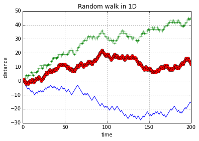
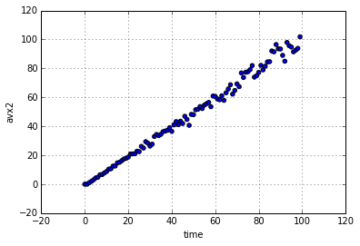
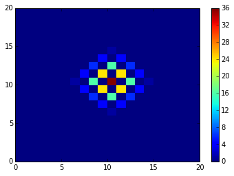
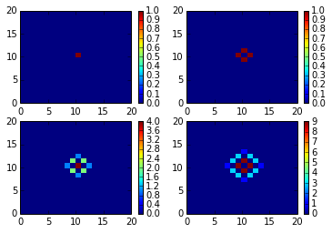
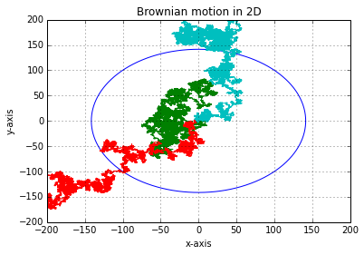
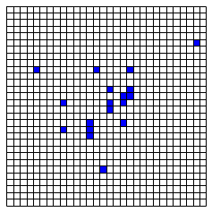
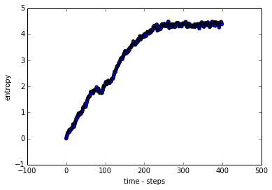
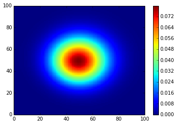

# Random Walk, Diffusion and Percolation

### Random Walk in 1D

One can easily see the property:

 $ < x^{2} > = 2 D t $

Where D is diffusion cofficient and t is time taken  


```python
import numpy as np
import random as random
import math as math
import matplotlib.pyplot as plt
```


```python
def walk(nstep):
    x = 0;t = 0
    X = [0];T = [0] 
    for k in range(nstep):
        r = random.random()
        if r < 0.5: x = x+1; t = t+1
        else: x = x-1; t = t+1
        X.append(x)
        T.append(t)
    return X,T
```


```python
N = 200
```


```python
X1,T1 = walk(N)
X2,T2 = walk(N)
X3,T3 = walk(N)

plt.figure(1)

plt.plot(T1,X1,"-") 
plt.plot(T2,X2,"+")
plt.plot(T3,X3,"o")

plt.title("Random walk in 1D")
plt.xlabel("time")
plt.ylabel("distance")
#plt.axis([0,200,-30,30]) 
plt.grid()
plt.show() 
```





Calculation of $x^{2}$:


```python
nwalk = 100
nav = 1000
X2AV = []
TN = []
for iwalk in range(nwalk):
    XX = []
    for iav in range(nav):
            X,T = walk(iwalk)
            xx = X[iwalk-1]**2
            XX.append(xx)
    x2av = np.mean(XX)
    X2AV.append(x2av)
    TN.append(iwalk)

plt.figure(2)
plt.scatter(TN,X2AV)
plt.xlabel("time")
plt.ylabel("avx2")
#plt.axis([0,500,-100,100]) 
plt.grid()
plt.show() 
```





From above figure it is clear that $D = \frac{1}{2}$

### Diffusion of probability

Under Brownian motion probability per lattice follows diffusion equation which can be proved as follows:

First of all we set the dimension L of lattice.


```python
L = 20
```

We can use this vacant list to create initial configuration where initially particle is at middle of the lattice.


```python
P =  [[0 for i in range(L)]for j in range(L)]
P[L/2][L/2] = 1
```

Now we need couple of functions to run further steps and control boundary conditions:

Disffusion step:


```python
def ld(k):
    if k==0: return L
    else: return 0
```


```python
def diffuse(P):
    PP =  [[0 for i in range(L)]for j in range(L)]
    
    for i in range(L):
      for j in range(L):
        if P[i][j] > 0:
            pt = P[i][j] 
            PP[(i+1)%L][j] = PP[(i+1)%L][j]+pt
            PP[(i-1)+ ld(i)][j] = PP[(i-1)+ ld(i) ][j]+pt
            PP[i][(j+1)%L] = PP[i][(j+1)%L]+pt
            PP[i][(j-1)+ ld(j) ] = PP[i][(j-1)+ ld(j) ]+pt
    return PP

```

We run the diffusion step with desire no of run steps called "nrun"


```python
def runner(P,irun):
    rn = 0
    while rn < irun:
        P = diffuse(P)
        rn = rn+1
    return P
```

We can make a plot of arbitraty diffusion step by selecting "irun" in function runner.


```python
x = [k for k in range(L+1)]
y = [k for k in range(L+1)]
#setup the 2D grid with Numpy
x, y = np.meshgrid(x, y)

P = [[0 for i in range(L)]for j in range(L)]
P[L/2][L/2] = 1
plt.pcolormesh(x, y, np.array(runner(P,4)))
plt.colorbar() 
plt.show() 


```





###### Plot of diffusion pattern of probability


```python
def configure(P,nplot):
  P = [[0 for i in range(L)]for j in range(L)]
  P[L/2][L/2] = 1
  P_stor = [P for k in range(nplot)]
  for iplot in range(nplot):
     P = runner(P_stor[iplot],iplot)
     P_stor[iplot] = P
  return P_stor
        
```


```python
nplot = 4
```


```python
x = [k for k in range(L+1)]
y = [k for k in range(L+1)]
#setup the 2D grid with Numpy
x, y = np.meshgrid(x, y)

P = [[0 for i in range(L)]for j in range(L)]
P[L/2][L/2] = 1


def sub_plotter(nplot):
    a = np.sqrt(nplot)
    for k in range(nplot):
        ch = chr(k)
        plt.subplot(a,a,k+1)
        plt.pcolormesh(x, y, np.array(runner(P,k)))
        plt.colorbar() 
       


sub_plotter(nplot)
plt.show() 


```





Above plot represents the subsiquent steps in simulations:

### Brownian Motion


```python
nstep = 20000
```

Function to walk one step ahead


```python
def move(x0,y0):
    r = random.uniform(0,1)
    if r < 0.25:
        x = (x0+1)
        y = y0
    elif r>0.25 and r < 0.5:
        x = x0-1
        y = y0
    elif r < 0.75 and r> 0.5:
        x = x0
        y = (y0+1)
    else :
        x = x0
        y = y0-1
    return x,y
```

Function to store path


```python
def path(U):
    x = 0
    y = 0
    for i in range(nstep):
            x,y = move(x,y) 
            U[0][i] = x
            U[1][i] = y
           
            
   
```

We generate three different paths


```python
U = [[0 for i in range(steps)] for j in range(2)]
V = [[0 for i in range(steps)] for j in range(2)]
W = [[0 for i in range(steps)] for j in range(2)]
path(U)
path(V)
path(W)
```

###### Plot of random walk in 2D


```python

theta = np.arange(0,2.0*np.pi,2.0*np.pi/float(1000))
xt = np.sqrt(steps)*np.cos(theta)
yt = np.sqrt(steps)*np.sin(theta)

plt.figure(2)
plt.plot(xt,yt,'-')
plt.plot(U[0],U[1],"-")
plt.plot(V[0],V[1],"-")
plt.plot(W[0],W[1],"-")
plt.axis([-200, 200, -200, 200])
plt.xlabel("x-axis")
plt.ylabel("y-axis")
plt.grid()
plt.title("Brownian motion in 2D")
plt.show()
```





## Critical Exponent

Critical exponent can be expressed by the following approximate relation:

$|x_{1} -x_{0}| = (t_{1} -t_{0})^{\nu}$

 where :

$\nu = \frac{1}{2}$


```python
U = [[0 for i in range(nstep)] for j in range(nstep)]
val_stor = []
for k in range(1000):
    path(U)
    max_val = 0  
    for i in range(nstep):
        val = math.sqrt(U[0][i]**2 + U[1][i]**2)
        if val > max_val:
            max_val = val
    val_stor.append(val)     
    
```


```python
mn = mean(val_stor)
mn,math.sqrt(steps)
```


    (90.920181182226216, 100.0)


### Diffusion Equation

Diffusion equation is:

 $\frac{\partial P}{\partial t} = \nabla ^2 P$

#### Diffusion model

Let's construct a diffusion model


```python
def migrate(A):
    for p in range(L):
        for q in range(L):
             r = random.randint(1,4)
             if A[p][q] > 0:
                   A[p][q] = A[p][q] -1
                   if r ==1:A[(p+1)%L][q] = A[(p+1)%L][q]+1
                   elif r ==2: A[(p-1)+ ld(p)][q] = A[(p-1)+ld(p)][q]+1
                   elif r ==3: A[p][(q+1)%L] = A[p][(q+1)%L]+1
                   else:  A[p][(q-1)+ ld(q)] = A[p][(q-1)+ld(q)]+1
    return A
```


```python
def dynamics(nstep):
        A = [[0 for k in range(L)]for l in range(L)]
        A_stor = [A for step in range(nstep)] 
        A[L/2][L/2] = 100
        
        istep = 0
        while istep < nstep:
               A_stor[istep] = A
               A = migrate(A)
               istep = istep+1
        
        return A_stor
```


```python
def config_plotter(A,N):
        tt = 1.0
        s_map = [(float(p),float(q)) for p in range(N) for q in range(N)]
        site = 0
        for p in range(N):
             for q in range(N):
               if abs(A[p][q]) == 0.0 :
                  rtgl = pylab.Rectangle(s_map[site], tt,tt, fc='white')
                  pylab.gca().add_patch(rtgl)
               if abs(A[p][q]) > 0.0 :
                  rtgl = pylab.Rectangle(s_map[site], tt,tt, fc='blue')
                  pylab.gca().add_patch(rtgl)
               site = site+1
    
    
        Dx = float(N) 
        Dy = float(N)
        pylab.axis('scaled')
        pylab.axis([0.0,Dx,0.0,Dy])
        pylab.xticks([])
        pylab.yticks([])
        pylab.show()
        return                             
    
    
```


```python
    
L = 30
nstep = 50

Cfg = [[0 for k in range (L)]for l in range(L)]
A_stor = dynamics(nstep)
#which step to plot? write item = 
item = 2
Cfg = A_stor[item]
config_plotter(Cfg,L)
```





### Entropy


```python
def prob(A):
      pA = [[0 for k in range(L)]for l in range(L)]
      sm = sum(A)
      for p in range(L):
        for q in range(L):
           pA[p][q] = A[p][q]/float(sm)
      return pA                  
              
```


```python
def entropy (A,nstep):
        pA = [[0 for k in range(L)]for l in range(L)]
        entropyBag = [0 for istep in range(nstep)]
        
        istep = 0
        while istep < nstep:       
            pA = prob(A)
            s = 0.0        
            for p in range(L):
                for q in range(L):
                    if A[p][q] > 0:
                        s = s - pA[p][q]*math.log(pA[p][q]) 
                     
            entropyBag[istep] = s
        
            A = migrate(A)               
            istep = istep+1
        
        return entropyBag
       
```


```python

```


```python
def entropy_plotter(nstep,S):
    
             x = [istep for istep in range(nstep)]
             plt.figure(1)
             plt.scatter(x,S)
             plt.xlabel("time - steps")
             plt.ylabel("entropy")
             plt.show()
    
             return
             
```


```python
  
L = 20
nstep = 400
P = [[0 for i in range(L)]for j in range(L)]
P[L/2][L/2] = 100
S = entropy(P,nstep)
entropy_plotter(nstep,S)

```





### Diffusion Histogram using Diffusion Equation:


```python
L =100
```


```python
P = [[0 for i in range(L)]for j in range(L)]
P[L/2][L/2] = 100
```


```python
def update(P,nstep):
    istep = 0
    while istep < nstep:
        for i in range(L):
            for j in range(L):
                P[i][j] = (0.25)*(P[(i+1)%L][j] + P[(i-1)+ld(i)][j] + P[i][(j+1)%L] + P[i][(j-1)+ld(j)])
        istep = istep+1
    return P
    
```


```python
P = update(P,200)
x = [k for k in range(L+1)]
y = [k for k in range(L+1)]
x, y = np.meshgrid(x, y)
plt.pcolormesh(x, y, np.array(P))
plt.colorbar() 
plt.show() 

```





###  Percolation


```python

```


```python

```


```python

```


```python

```


```python

```


```python

```


```python

```


```python

```


```python

```


```python

```

### Kotch Curve


```python
nod = 10
L = 100
XX = []


XY[0] = [[0,0],[0,1]]
for iod in range(nod):
    
    
        
     l = L/(float(3**iod))
     XY[1][0] = XY[0][0]  
     XY[1][1] = XY[0][0]   
   
    
    
   
```
